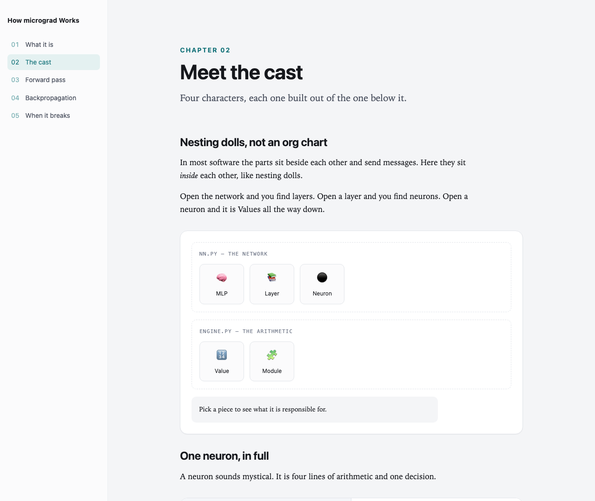
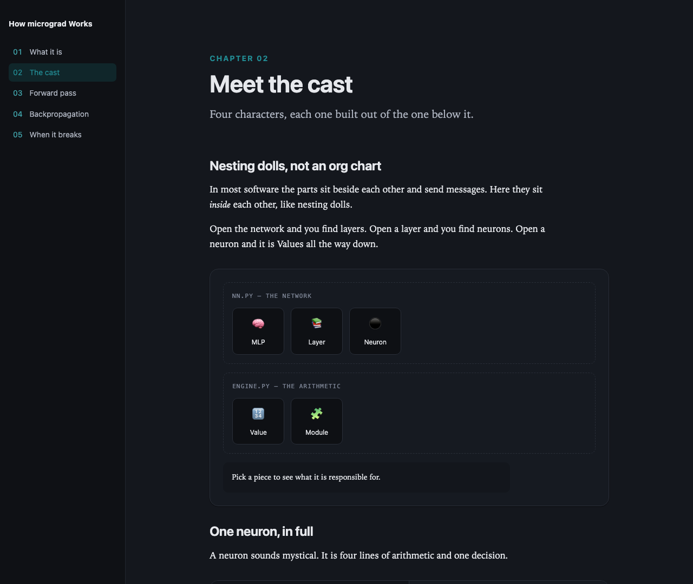

# Understory

Turn a codebase into an interactive course that teaches a non-programmer how it
actually works.

Point an AI coding agent at a repository. Get back a single-page site that opens
in any browser with no build step and no network: scroll-through chapters, real
code beside a plain-English reading of it, step-through animations of data
moving between parts, the components talking to each other in a chat thread, and
questions that test judgement rather than recall.

<p align="center">
  
  
</p>

## Who it is for

People who build software by directing AI tools, and have never been taught
computer science. They have used the thing. They have never read it.

The goal is not to make them engineers. It is to let them steer AI better,
notice when it is wrong, get unstuck alone, and describe what they want
precisely enough to get it.

## Use it

`SKILL.md` is an [open standard](https://agentskills.io/specification) read by
25+ agents — Claude Code, Codex, Cursor, Gemini CLI, Copilot, Goose and others.
In Claude Code, install it as a plugin from the
[catalog](https://github.com/code-with-rashid/agent-skills):

```
/plugin marketplace add code-with-rashid/agent-skills
/plugin install understory@codewithrashid-skills
```

Anywhere else, clone and copy the skill folder into your tool's skills directory:

```bash
git clone https://github.com/code-with-rashid/understory.git
cd understory
python3 install.py claude     # ~/.claude/skills  (Claude Code, Cursor, Copilot)
python3 install.py skills     # ~/.agents/skills  (Codex CLI, Gemini CLI, Cursor, Copilot)
```

`install.sh` takes the same targets. For tools that only read a plain
instructions file (these refuse to overwrite an existing file unless you add `--force`):

```bash
python3 install.py agents     # ./AGENTS.md
python3 install.py cursor     # ./.cursor/rules/understory.mdc
python3 install.py copilot    # ./.github/copilot-instructions.md
```

Then ask your agent: *"turn ./my-project into a course."*

By hand, or from an agent with only a shell:

```bash
python3 skills/understory/toolkit/scaffold.py init "How X Works" --palette pine \
        --source ../x --root ./x-course
cd x-course
python3 scaffold.py chapter 1 what-it-does --parts beat,rows,annotated,trace,check
# fill in the TODOs
python3 build.py && python3 verify.py --src ../x

# to share it: one file, no server, no network
python3 build.py --inline --out "How X Works.html"
```

## What makes it hold together

**Nothing is wired by hand.** Chapters are generated already connected to the
engine; authors replace `TODO` text and nothing else. There are no handler
functions to call and no inline `onclick` anywhere, so markup cannot reference a
function that does not exist.

**Every component is isolated.** One malformed component logs a warning and the
rest of the page carries on. A single stray apostrophe cannot take out half a
course.

**The build checks itself.** `verify.py` catches what a browser will not tell
you — unfilled scaffolding, duplicate ids, a step naming a node that does not
exist, malformed JSON in an attribute, a quiz whose answer matches no option, a
chapter with no definitions — and, with `--src`, that every code snippet appears
**verbatim** in the real repository.

**The engine is tested.** `python3 test/run.py` drives every component in real
Chrome and asserts what it does, three times over: wide, narrow, and dark. No
browser-automation dependency; the assertions run inside the page and post their
verdicts back.

## Design

Light and dark, decided by the reader's system. Body text is a serif at a
comfortable measure, because a course is read rather than scanned. System fonts
throughout, so the page owes nothing to a CDN and looks right offline. Six
palettes, each with separate light and dark accents chosen to clear WCAG AA in
both. Definitions open in the browser's top layer, so they cannot be clipped and
they close on `Esc`. Motion respects `prefers-reduced-motion`. Everything
readable with JavaScript switched off.

## Layout

```
skills/understory/   the Agent Skills package (what installers copy)
  SKILL.md           entry point — read natively by 25+ agent tools
  INSTRUCTIONS.md    the whole procedure, harness-neutral
  guides/            writing.md · components.md · pitfalls.md
  adapters/          AGENTS.md, Cursor rule, Copilot instructions, paste-in prompt
  toolkit/           course.css · course.js · shell.html
                     build.py · verify.py · scaffold.py · figures.py · snippets/
test/                fixture + in-page harness + runner + spec validator
examples/            a course built from karpathy/micrograd
```

## Portability

The toolkit is Python 3 and a browser, nothing else — no npm, no packages, no
network, and the imports are checked to be standard-library only. The skill
conforms to the Agent Skills specification (validated by
`test/validate_skill.py`), so any of the 25+ SKILL.md-reading agents can load it
directly; the adapters cover everything else, down to a paste-in prompt for a
plain chat window.

Smaller models are handled by removing the hard part rather than by asking
nicely: the scaffolder emits the wiring, so the model only writes prose, and the
verifier refuses anything it got wrong.

## Licence

MIT. See `LICENSE`.
